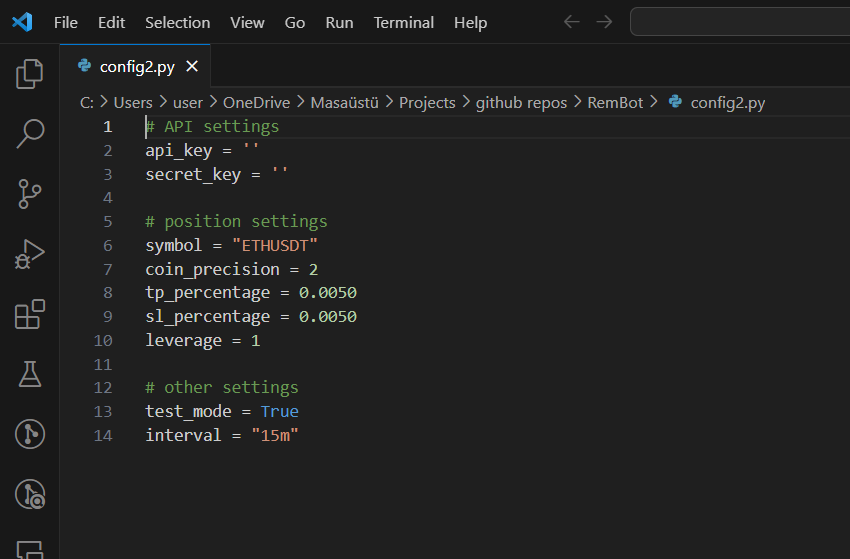
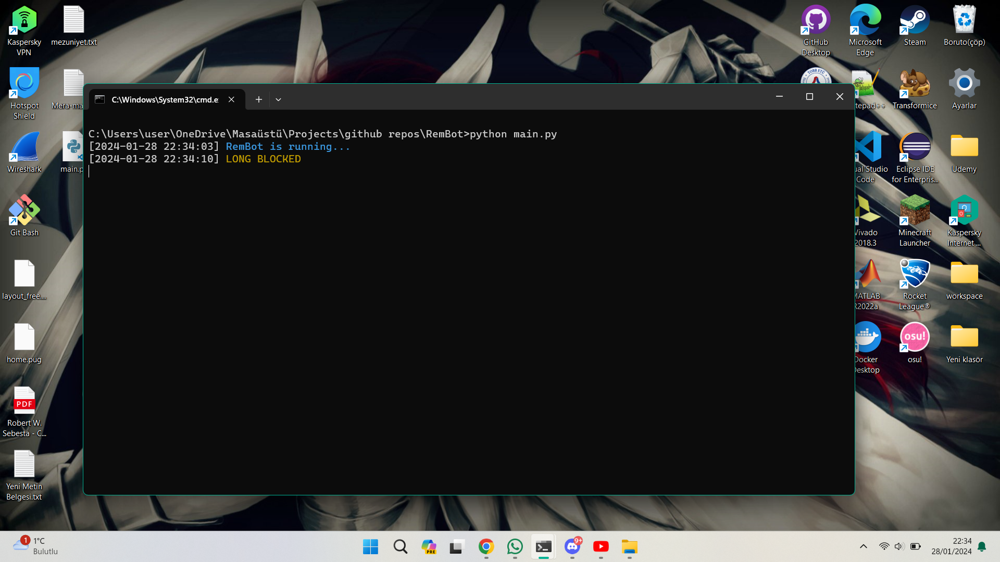

<div align="center">
    <h1> RemBot </h1>
    
</div>

## Table of Contents

- [Description](#description)

- [How It Works?](#how-it-works)

- [Technologies Used](#technologies-used)

- [Installation](#installation)

- [Configuration](#configuration)

- [Running the bot](#running-the-bot)
 
- [Warnings](#warnings) 


## Description

RemBot is an experimental cryptocurrency trading bot. This bot monitors specific conditions and, if met, strategically enters the appropriate position ("LONG" or "SHORT"). With its simple algorithm, RemBot ensures precise decision-making in the dynamic world of crypto trading, offering users a reliable tool to navigate the markets effectively. Stay ahead of the curve and let RemBot empower your crypto trading journey.

<div align="center">
    
</div>

## How It Works?
REM stands for RSI-EMA-MACD

When certain conditions are met, Bot enters position automatically.

```bash
    while True:
        if (MACD_12 > MACD_26) and (MACD_12 < 0) and (EMA_100 > price) and (RSI_6 > 50):
            # Enter LONG...
        
        elif (MACD_12 < MACD_26) and (MACD_12 > 0) and (EMA_100 < price) and (RSI_6 < 50):
            # Enter SHORT...
```

You can check out this video for MACD Strategies.

<div align="center">
    <a href="https://www.youtube.com/watch?v=Gs-_tleyz3Q&ab_channel=TRADEEMPIRE"> </a>
</div>

## Technologies Used

1. **Python:** The primary programming language driving RemBot's functionality and logic.

2. **Binance API:** RemBot connects seamlessly to the Binance cryptocurrency exchange through its API, allowing real-time access to market data and execution of trades.

3. **TA-Lib Library:** Technical Analysis Library provides essential functions for technical analysis of financial markets, aiding RemBot in evaluating market indicators.

4. **ChatGPT:** ChatGPT, powered by OpenAI, is employed for code assistance, aiding developers in coding tasks and providing guidance on library usage. Additionally, ChatGPT is used for crafting informative log messages, enhancing communication and facilitating a smoother understanding of RemBot's operations.

<div align="center">
    <p> 
        <a href="https://www.python.org/">  </a>
        <a href="https://github.com/sammchardy/python-binance">  </a>
        <a href="https://pypi.org/project/TA-Lib/">  </a>
        <a href="https://chat.openai.com/chat" target="_blank">  </a>
    </p>
</div>

## Installation

To install Project, follow these simple steps:

1.  **Install Python:**  
	- Visit [Python official website](https://www.python.org/downloads/) and download python. 
	- I strongly recommend downloading a version lower than 3.10 and higher than 3 to ensure that you can download it without any issues and run the Talib library smoothly.
2. **Cloning the Project into your local:**
    Go to the directory where you want to download the project using 'cd', and then type the following command
    ```bash
    $git clone https://github.com/basaryldrm06/RemBot
    ```
3. **Install Dependencies**
    Enter these commands in sequence.
    ```bash
    $cd RemBot
    $pip install -r requirements.txt
    ```

Upon successfully completing these steps, proceed to configure your settings and run the program.

In case you encounter any issues, kindly attempt to resolve them before moving forward.

If you are facing difficulties downloading the Talib library, consider trying a manual download from this [link](https://www.lfd.uci.edu/~gohlke/pythonlibs/).

## Configuration
Rename the file config2.py to config.py.

Open the config.py file to edit the settings, and fill in the empty fields according to your preferences.

<div align="center">
    
</div>

If you do not have an api key you can obtain one from this [link](https://www.binance.com/en/my/settings/api-management)

You can use the default values for other sections or customize them based on your preferences.

Once you have finished editing your settings, you will be ready to run the program.

## Running the Bot
If you have completed the previous steps, RemBot is now ready to run. Start it by entering the following command:

 ```bash
$python main.py
```

After running the command, you should see a screen similar to the one below.

<div align="center">
    
</div>

## Warnings
This trading bot has been developed solely for experimental purposes, aiming to explore the viability and effectiveness of automating algorithmic decision-making in financial transactions. It is a completely experimental project shared as open-source to serve as an example for the development of trading bots.

Any profits or losses incurred using this bot are entirely your responsibility. Please refrain from using the program if you are not familiar with its functionalities. Understand that engaging in financial transactions carries inherent risks, and it's crucial to exercise caution and knowledge when utilizing this bot.

<div align="center">
    
</div>

## Last Words from Developer
I hope you find this project useful and enjoyable.

Feel free to follow my account for more projects like this and stay updated on upcoming releases. Don't forget to star and watch this project to receive notifications about future updates and improvements.

Algorithmic Trading Bots represent a significant advancement in our era, providing a diverse array of applications within the financial landscape. While engaging in this project, my goal was to explore the capabilities of Algorithmic Trading Bots and their effectiveness in financial transactions. For this reason, this project was particularly intriguing and enjoyable for me.

If you have any innovative ideas in mind for trading bots or AI, feel free to reach out to me through the links on my profile. We can collaborate and develop something together.

Thank you for your interest and support! 🚀

<div align="center">
    <p> 
        <a href="mailto:basaryldrm06@gmail.com?subject=Hello%20basaryldrm06">  </a>
        <a href="https://www.linkedin.com/in/basaryldrm06/">  </a>
        <a href="https://github.com/basaryldrm06" target="_blank">  </a>
    </p>
</div>